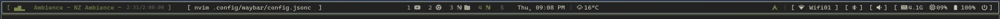

# Waybar

## This is what the waybar looks like:


## Steps:

### Step -1
- the obvious: ` git clone https://github.com/iamredpurple/waybar.git ~/waybar`

### Step 0
- if you know a little bit about arch linux, skip this guide, you know what to do.

### Step 1
- Check inside requirements.txt and remove the packages you dont need or have alternates to, install the rest, maybe something like: `yay -S --needed $(cat ~/waybar/requirements.txt | xargs)`

### Step 2
- copy scripts from ./dot-local-slash-bin and copy inside ~/.local/bin/, create if does not exist.
```mkdir -p ~/.local/bin && cp -r ~/waybar/dot-local-slash-bin/. ~/.local/bin/ ```
- make sure they are executable: ` chmod +x ~/.local/bin/** `
- check inside ~/.bashrc for this line: `export PATH="$HOME/.local/bin:$PATH" `
- add if doesnt exist, then in terminal, run: `source ~/.bashrc`

### Step 3
- backup your existing stuffs:
```
mv ~/.config/waybar/config.jsonc ~/.config/waybar/config-bak.jsonc
mv ~/.config/waybar/style.css ~/.config/waybar/style-bak.css
```

- then copy the custom_modules folder, config.jsonc, and style.css inside ~/.config/waybar
```
cp -r ~/waybar/custom_modules/ ~/.config/waybar/
cp ~/waybar/config.jsonc ~/.config/waybar/
cp ~/wayabr/style.css ~/.config/waybar/
```

- make custom_modules executable: `chmod +x ~/.config/waybar/custom_modules/** `

### Step 4
- reload the waybar: `killall -SIGUSR2 waybar`

## Note:
- If you use separate programs or "apps" you can easily configure the buttons to do whatever you like by going inside ~/.config/waybar/config.jsonc and looking for "on-click"...change it to do whatever you want. But dont forget to reload your waybar like in Step 4 after changing config.jsonc

- If this doesnt work, oops...sorry!

